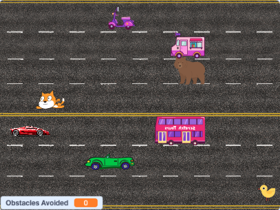

# Problem Set 0

-----

## Starting from Scratch
[Link](https://cs50.harvard.edu/x/2024/psets/0/scratch/) to project requirements.

**Project Overview:**  
- The "Road Block!" project is a Scratch game designed to challenge players' reflexes as they navigate a car through a series of roadblocks.   
- The main objective of the game is to avoid obstacles and accumulate points for every roadblock successfully avoided.   
- The game ends when the car collides with an obstacle.  

**Gameplay:**  
- Players control the car with ⬆️ or ⬇️ arrow keys to dodge incoming roadblocks.  
- Each time a roadblock is successfully avoided, the score increases.  
- The game provides a visual representation of the score, motivating players to improve with each attempt.   
- When the car hits a roadblock, the game ends, and the player’s final score is displayed.  

**Complexity:**  
- While the game remains accessible to players of all skill levels, it is designed to be more complex than basic Scratch examples, with the use of custom blocks, multiple conditionals, and dynamic interactions between sprites.

**Images:**  
 

-----

## Set Up

To interact with Scratch with `Road Block!.sb3`:
1. Open the [Scratch website]()
2. Log in to your account, then click "Create" to open the editor.
2. Go to "File" > "Load from your computer" and upload `Road Block!.sb3` file.
4. Click on  to start the game.
